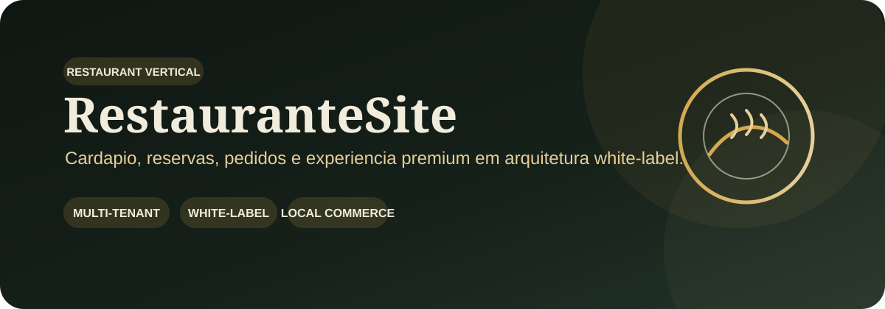
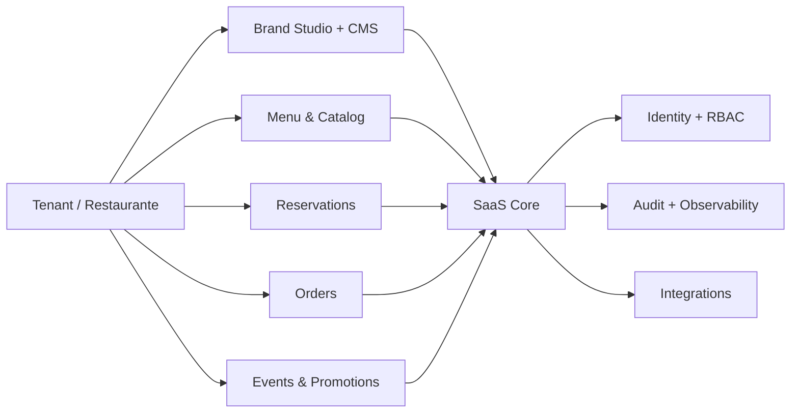

  

  
  
  

# RestauranteSite

Experiência premium para restaurantes e bistrôs, estruturada para evoluir para um **vertical SaaS multi-tenant e white-label** sem perder identidade, storytelling e conversão local. O case visual atual é **Chez Amis Bistrô** e serve como tenant demonstrativo/documental.

> **Novo cliente = novo tenant + configuração.** Cardápio, marca, mídia, reservas, contatos e integrações mudam por cliente; o core permanece compartilhado.

## ✨ Visão do produto

| 🍽️ Cardápio digital | 🛒 Carrinho & pedido | 📅 Reservas | 💬 WhatsApp |
| --- | --- | --- | --- |
| Categorias, busca, detalhes e adicionais | Itens, quantidades, observações e checkout estruturado | Jornada de reserva com CTA contextual | Pedidos e reservas com mensagem pré-preenchida |

| 📍 Presença local | 📸 Conteúdo & galeria | ♿ Acessibilidade | 🎨 White-label |
| --- | --- | --- | --- |
| Mapa, rota, horários e SEO local | Storytelling, promoções e mídia do estabelecimento | Semântica, foco visível e reduced-motion | Paleta, logo, tipografia, menu, contatos e páginas por tenant |

## 🧭 Experiência do case Chez Amis

A apresentação comercial é a referência visual/documental deste README e organiza o produto como uma jornada: **home → cardápio → carrinho → reservas → história da casa → localização → contato**.

  <a href="docs/CHEZ_AMIS_BISTRO_PROPOSTA_COMERCIAL.pdf"><strong>📄 Abrir apresentação comercial — Chez Amis Bistrô</strong></a>

## 🧩 Direção SaaS

O vertical compartilha o núcleo de tenancy, identidade/RBAC, Brand Studio, CMS, Media Manager, planos/entitlements, billing, integrações, auditoria e observabilidade do **Tupiniquim Vertical SaaS**, mantendo as particularidades de restaurante como módulos próprios.

## 🔐 Segurança e qualidade

- regras de negócio e autorização sensível devem ficar no servidor;
- dados de tenant precisam de escopo e isolamento server-side;
- formulários, reservas, pedidos e webhooks devem ter validação e proteção contra abuso;
- secrets ficam fora do Git e do frontend;
- dados demonstrativos não podem virar dados reais silenciosamente;
- CI executa instalação travada, scripts disponíveis, TypeScript/build, audit de dependências e CodeQL;
- ausência de lint/test coverage permanece **release blocker**.

## 📚 Documentação

- [Plano do vertical SaaS](docs/SAAS_VERTICAL_PLAN.md)
- [Auditoria Tupiniquim Toolbox](docs/TOOLBOX_AUDIT_2026-09-10.md)
- [Política de segurança](SECURITY.md)
- [Apresentação comercial — Chez Amis Bistrô](docs/CHEZ_AMIS_BISTRO_PROPOSTA_COMERCIAL.pdf)
- [Monorepo canônico — Sistema SaaS Geral](https://github.com/tupiniquimtechsolution-blip/Sistema-SaaS-Geral)

## 🚦 Estado real

O produto possui baseline visual e funcional forte para o vertical Restaurante. A migração para o SaaS Core deve preservar a experiência atual enquanto substitui dados locais e persistências ad hoc por contratos multi-tenant auditáveis. **Não declarar production-ready sem isolamento cross-tenant, autorização server-side, observabilidade, backup/rollback e gates verdes.**
